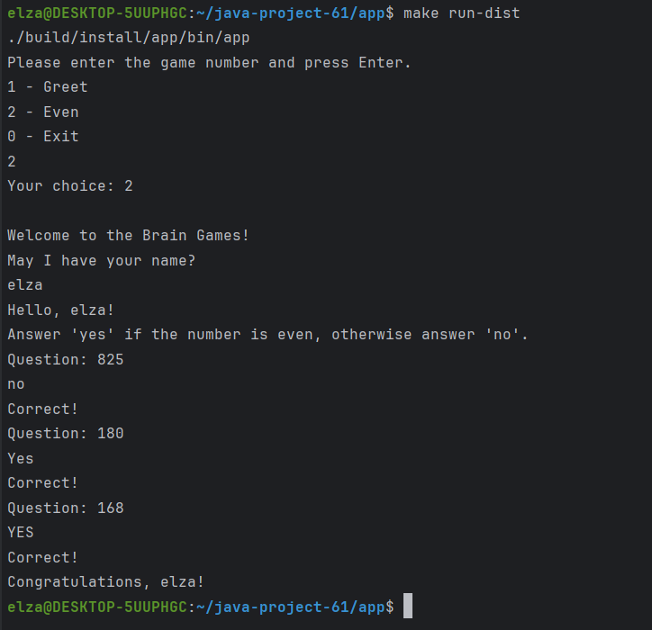
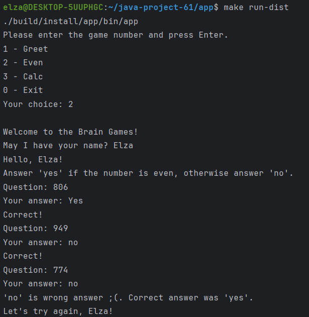
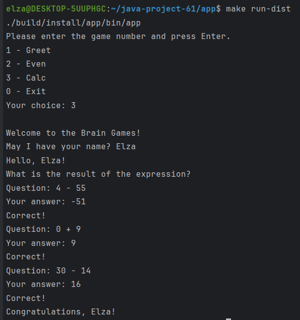
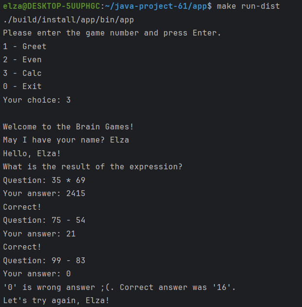
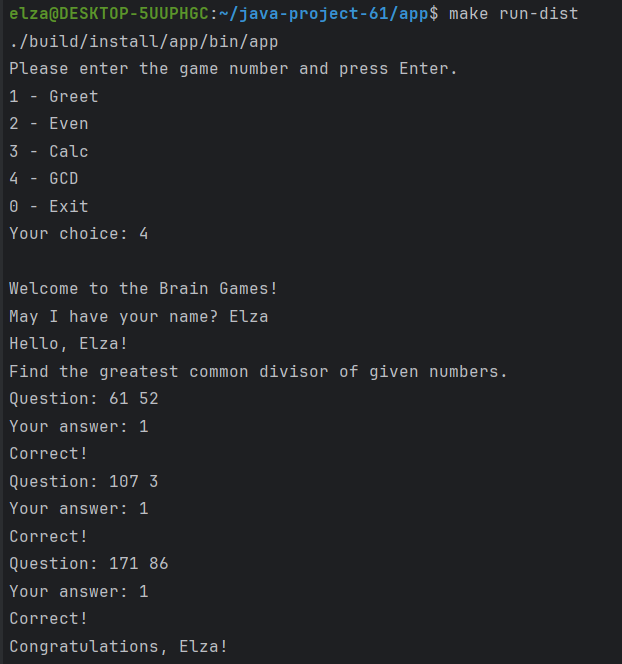
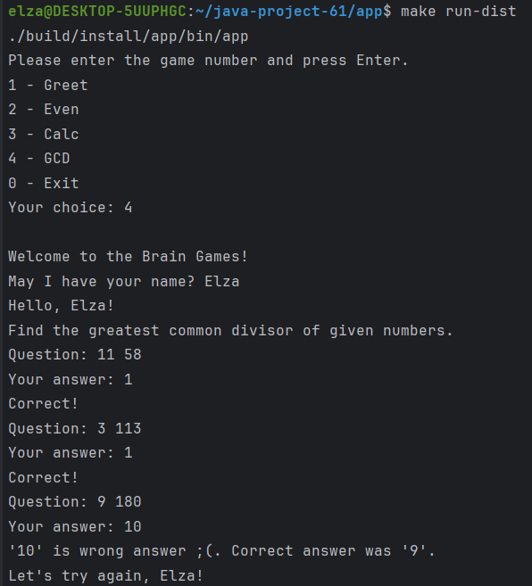

### Hexlet tests and linter status:

## Примеры прохождения игр:

  
2 - Even. Игра: "Проверка на чётность"

Пример успешного прохождения игры:

Пример неуспешного прохождения игры:

  
3 - Calc. Игра: "Калькулятор"

Пример успешного прохождения игры:

Пример неуспешного прохождения игры:

  
4 - GCD. Игра: "НОД"

Пример успешного прохождения игры:

Пример неуспешного прохождения игры:

