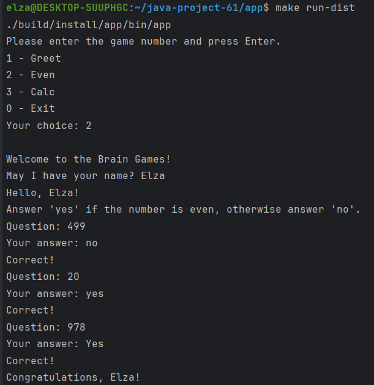

### Hexlet tests and linter status:

[](https://github.com/ElsaAkhmatyanova/java-project-61/actions)

[](https://codeclimate.com/github/ElsaAkhmatyanova/java-project-61/maintainability)

# Игры разума

## Описание
**«Игры разума»** — набор из пяти консольных игр, построенных по принципу популярных мобильных приложений для прокачки мозга.  
Каждая игра задает вопросы, на которые нужно дать правильные ответы. После трех правильных ответов считается, что игра пройдена.  
Неправильные ответы завершают игру и предлагают пройти ее заново.

### Игры:
- **Калькулятор** – арифметические выражения, которые необходимо вычислить.
- **Прогрессия** – поиск пропущенных чисел в последовательности.
- **Определение четного числа**.
- **Определение наибольшего общего делителя**.
- **Определение простого числа**.

## Запуск
1. Склонируйте проект и выполните его сборку: 
```
./gradlew installDist
```
2. Запустите игру:
```
make run-dist
```

## Примеры прохождения игр

<details>
  <summary>2 - Even. Игра: "Проверка на чётность"</summary>

Пример успешного прохождения игры:


Пример неуспешного прохождения игры:

</details>

<details>
  <summary>3 - Calc. Игра: "Калькулятор"</summary>

Пример успешного прохождения игры:


Пример неуспешного прохождения игры:

</details>

<details>
  <summary>4 - GCD. Игра: "НОД"</summary>

Пример успешного прохождения игры:


Пример неуспешного прохождения игры:

</details>

<details>
  <summary>5 - Progression. Игра: "Арифметическая прогрессия"</summary>

Пример успешного прохождения игры:


Пример неуспешного прохождения игры:

</details>

<details>
  <summary>6 - Prime. Игра: "Простое ли число?"</summary>

Пример успешного прохождения игры:


Пример неуспешного прохождения игры:

</details>